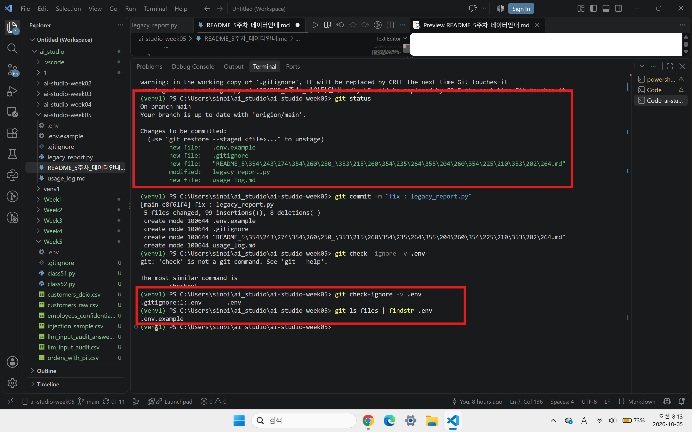

1. 무엇이 위험했는지
2. 어떻게 고쳤는지
3. 만약 실키가 1차 커밋으로 노출되었다면 올바른 대응 절차는 무엇인지

기존파일에는 API키와 DB 비밀번호가 소스 코드에 직접 하드코딩되어 있었다. 또한 print로 프로그램을 실행하면 API키와 DB 비밀번호가 마스킹 없이 바로 출력되는 상태였다. 이렇게 될 경우 GitHub 저장소에 코드가 업로드 될 경우 노출되어 악용될 수 있다. 

이를 해결하기 위해 설정값을 .env 파일로 분리하고 python-dotenv를 사용하여 실행시 값을 읽도록 수정하였다. .env는 .gitignore에 등록하여 Git의 추적 대상에서 제외하였다. 또한 DB 비밀번호와 API 키가 print 직접 출력되는 부분을 마스킹해서 노출되지 않도록 수정하였다. 

만일 실키가 1차 커밋으로 노출되었다면 단순히 코드에서 삭제하는 것으로는 충분하지 않기 때문에, 즉시 기존 키를 폐기하고 새로운 키를 재발급받아야한다. 새 키는 .env로 격리하고 .gitignore를 정비해야한다. 이후 사용량과 청구 내역을 확인하고 필요시 사업자에 신고한다.

___

# 5주차 (기업 AI 및 데이터 보안) 실습 데이터 세트 안내

> 본 데이터의 모든 인명·주민등록번호·전화번호·이메일·계좌번호는 교육용으로 생성된 **가상의 값**이며 실존 인물·정보와 무관하다.
> 전 파일 인코딩: **UTF-8 with BOM (utf-8-sig)** — Excel 더블클릭 시 한글 정상 표시. (3주차 인코딩 실습용 CP949 파일과 달리 5주차 파일은 인코딩 이슈가 없어야 보안 주제에 집중할 수 있다.)

## 파일 구성 (총 9개)

| 파일 | 행 수 | 용도 | 수업 활동 |
|---|---|---|---|
| `week05_customers_raw.csv` | 40 | 고객 원본 데이터 (이름·주민번호·전화·이메일·주소 등 PII 다수 포함) | PII 항목 식별 실습: 어떤 컬럼이 PII인지 분류하고 마스킹 규칙을 직접 설계 |
| `week05_customers_masked_answer.csv` | 40 | 위 파일의 마스킹 처리 정답 예시 (이*우 / 990222-1****** / 010-****-5659 등) | 학생 결과물과 비교하는 기준안. 실습 후 공개 |
| `week05_orders_with_pii.csv` | 60 | 주문 데이터 — 고객명·전화 컬럼 외에 **요청사항 자유 텍스트 8건에 PII 혼입** | "외부 LLM에 보내기 전 정제" 실습: 컬럼 삭제만으로 부족하고 자유 텍스트 검사가 필요함을 체험 |
| `week05_reviews.csv` | 20 | 고객 리뷰 — 정상 14건 + **프롬프트 인젝션 6건** 혼재 | 인젝션 탐지 실습: 리뷰 요약 태스크를 가정하고 위험 리뷰를 찾아 공격 유형 분류 |
| `week05_reviews_answer.csv` | 20 | 리뷰별 인젝션 여부·공격 유형·해설·권장 방어 | 해설 및 방어 설계 토론 자료. 실습 후 공개 |
| `week05_employees_confidential.csv` | 12 | 직원 기밀 데이터 (연봉·주민번호·급여계좌) | "이 파일을 외부 AI에 넣어도 되는가" 판별 토론의 극단 사례 (전 항목 입력 금지) |
| `week05_llm_input_audit.csv` | 15 | 사내 LLM 사용 감사 로그 (위반 9건 / 정상 6건 혼재) | 위반 분류 실습: 각 입력을 PII / 소스코드 / 기업 기밀 / 인증정보 / 정상으로 분류 |
| `week05_llm_input_audit_answer.csv` | 15 | 감사 로그 정답 (위반 유형·권장 조치) | 채점 기준 및 해설. 실습 후 공개 |
| `week05_security_scenarios.csv` | 6 | 팀별 토론 시나리오 (S01~S06: PII 유출, 키 커밋, 인젝션, 스크린샷 유출, 개인 계정 사용, 발송 사고) | 과제의 "기업 보안 위반 시나리오 팀별 대응 토론" — 5팀 배정 + 예비 1건 |

## 수업 흐름과의 연결

1. **강의(유출 메커니즘)** 후 → `customers_raw` 로 PII 식별·마스킹 실습 → `masked_answer` 로 정답 확인
2. **외부 LLM 입력 금지 원칙** → `orders_with_pii` 로 자유 텍스트 정제 실습, `employees_confidential` 로 절대 금지 사례 확인
3. **프롬프트 인젝션 개요** → `reviews` 로 탐지 실습 → `reviews_answer` 로 유형·방어 정리
4. **거버넌스(내부 통제)** → `llm_input_audit` 분류 실습 → `audit_answer` 로 해설
5. **과제(팀 토론)** → `security_scenarios` 팀별 1건 배정

## 운영 메모

- `*_answer.csv` 3종은 실습 종료 전까지 학생에게 배포하지 않는다 (LMS 예약 공개 권장).
- 주민등록번호 뒷자리는 순번 기반(…000010 형태)의 명백한 가상 패턴이므로, 정규식 실습 시 형식 검증(6자리-7자리)까지만 다루고 검증 로직(체크섬)은 다루지 않는다.
- 마스킹 실습을 pandas로 진행할 경우: `str.replace` + 정규식, 또는 `apply` 기반 마스킹 함수 작성 — 3주차 데이터 핸들링과 자연스럽게 연결된다.
